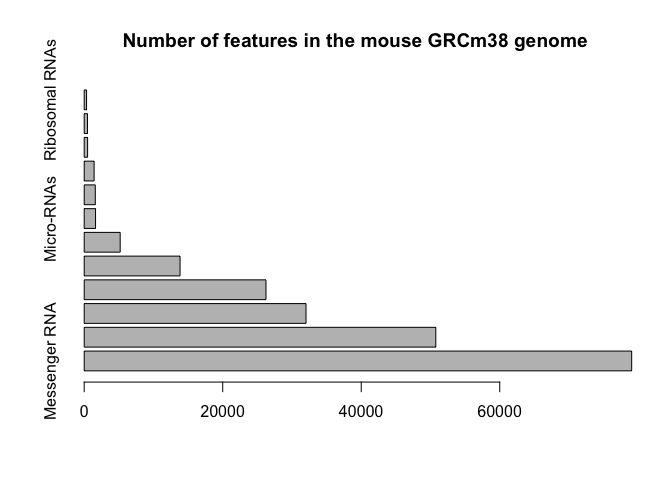

Class05
================
Xiaomei
Thu Nov 1 11:49:28 2018

``` r
#read.file("bimm143_05_rstats/")
weight <-read.table("bimm143_05_rstats/weight_chart.txt",header = TRUE)

plot(weight,type = "b")
```


``` r
# Make a custom plot
plot( weight,type="b",pch=15,col="blue",main="Baby weight over time",xlab="Age(months")
```


``` r
   # 1B Barplot 
counts <-read.table("bimm143_05_rstats/feature_counts.txt",header=TRUE,sep="\t")
#plot()


barplot(counts$Count, names.arg =counts$Feature,horiz=TRUE,las=1)
```


``` r
barplot(counts$Count,  names.arg =counts$Feature,horiz=TRUE,main="Number of features in the mouse GRCm38 genome")
```



``` r
# 1C His
hist(x <- c(rnorm(10000),rnorm(10000)+4))
```


``` r
hist(x, breaks=80)
```


``` r
hist(x <- c(rnorm(10000),rnorm(10000)+4))
```


``` r
#plotcharacter
plot( 1:5, pch=1:5, cex=1:5 )
```


``` r
plot( 1:10, pch=1:5, cex=1:5,col=c("red","blue"))
```


``` r
#section 3

#read.file("bimm143_05_rstats/")
#male  <-read.table("bimm143_05_rstats/male_female_counts.txt",header = TRUE)

#plot(male,type = "b")
#counts <-read.table("bimm143_05_rstats/feature_counts.txt",header=TRUE,sep="\t")
#plot()

mf <- read.delim("bimm143_05_rstats/male_female_counts.txt")

barplot(mf$Count, names.arg = mf$Sample,las=2,col = rainbow(nrow(mf)))
```


``` r
barplot(mf$Count, names.arg=mf$Sample, col= c("red","blue"))
```


``` r
# 3B color by value
        
genes <- read.delim("bimm143_05_rstats/up_down_expression.txt")

#how many genes are in this data ?
nrow(genes)
```

    ## [1] 5196

``` r
#How may are up and down and all round?
table(genes$State )
```

    ## 
    ##       down unchanging         up 
    ##         72       4997        127

``` r
#plot this data 
plot(genes$Condition1, genes$Condition2, col=genes$State )
```


``` r
#what are the default colors
palette()
```

    ## [1] "black"   "red"     "green3"  "blue"    "cyan"    "magenta" "yellow" 
    ## [8] "gray"

``` r
#changing the color to be useful color 
palette(c("red","green","blue")) 
plot(genes$Condition1, genes$Condition2, col=genes$State)
```


``` r
#3C dynamic use of color 
#color by point density 

meth  <-read.delim("bimm143_05_rstats/expression_methylation.txt",header= TRUE)


nrow(meth)
```

    ## [1] 9241

``` r
#first plot 
plot(meth$gene.meth, meth$expression)
```


``` r
##better but still not very useful
mycols  <-densCols(meth$gene.meth, meth$expression)
plot(meth$gene.meth, meth$expression, col=mycols)
```


``` r
##let's focus the data we interest
inds   <- meth$expression > 0
mycols2  <-densCols(meth$gene.meth[inds], meth$expression[inds])

plot(meth$gene.meth[inds], meth$expression[inds],col=mycols2)
```


``` r
## section 4
#4A understand someone elses codes 

#read.deli("bimm143_05_rstats/ex")
#meth  <-read.table(bimm143_05_rstats/weight_chart.txt",header = TRUE,sep "\
```
