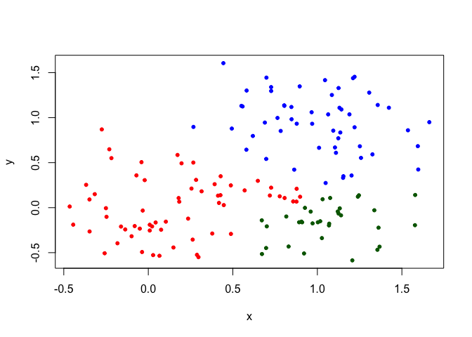

Class 8
================
Khine Win

K-means clustering
------------------

Our first example with **kmean()** function.

``` r
# Example plot to see how Rmarkdown works
plot(1:10,typ="l")
```


back to kmean ...

``` r
# Generate some example data for clustering
tmp <- c(rnorm(30,-3), rnorm(30,3))
x <- cbind(x=tmp, y=rev(tmp))
plot(x)
```


Use the kmeans() function setting k to 2 and nstart=20

Inspect/print the results

Q. How many points are in each cluster?

Q. What ‘component’ of your result object details- -cluster size?

-   cluster assignment/membership?
-   cluster center? Plot x colored by the kmeans cluster assignment and add cluster centers as blue points Q. Repeat for k=3, which has the lower tot.withinss?

``` r
k  <- kmeans(x, centers=2, nstart= 20)
k
```

    ## K-means clustering with 2 clusters of sizes 30, 30
    ## 
    ## Cluster means:
    ##           x         y
    ## 1  2.799126 -3.056408
    ## 2 -3.056408  2.799126
    ## 
    ## Clustering vector:
    ##  [1] 2 2 2 2 2 2 2 2 2 2 2 2 2 2 2 2 2 2 2 2 2 2 2 2 2 2 2 2 2 2 1 1 1 1 1
    ## [36] 1 1 1 1 1 1 1 1 1 1 1 1 1 1 1 1 1 1 1 1 1 1 1 1 1
    ## 
    ## Within cluster sum of squares by cluster:
    ## [1] 62.15477 62.15477
    ##  (between_SS / total_SS =  89.2 %)
    ## 
    ## Available components:
    ## 
    ## [1] "cluster"      "centers"      "totss"        "withinss"    
    ## [5] "tot.withinss" "betweenss"    "size"         "iter"        
    ## [9] "ifault"

Inspect/print the results

Q. How many points are in each cluster?

Q. What ‘component’ of your result object details- -cluster size?

``` r
k$size
```

    ## [1] 30 30

-   cluster assignment/membership?

``` r
k$cluster
```

    ##  [1] 2 2 2 2 2 2 2 2 2 2 2 2 2 2 2 2 2 2 2 2 2 2 2 2 2 2 2 2 2 2 1 1 1 1 1
    ## [36] 1 1 1 1 1 1 1 1 1 1 1 1 1 1 1 1 1 1 1 1 1 1 1 1 1

``` r
table(k$cluster)
```

    ## 
    ##  1  2 
    ## 30 30

-   cluster center?

``` r
k$centers
```

    ##           x         y
    ## 1  2.799126 -3.056408
    ## 2 -3.056408  2.799126

Plot x colored by the kmeans cluster assignment and add cluster centers as blue points

``` r
palette(c("blue","red"))
plot(x, col=k$cluster)
points(k$centers, col="green",pch=20, cex=3)
```


Q. Repeat for k=3, which has the lower tot.withinss?

``` r
k2 <- kmeans(x, centers = 2, nstart = 20)
k3 <- kmeans(x, centers = 3, nstart = 20)
k4 <- kmeans(x, centers = 4, nstart = 20)
k5 <- kmeans(x, centers = 5, nstart = 20)

k2$tot.withinss
```

    ## [1] 124.3095

``` r
k3$tot.withinss
```

    ## [1] 95.91914

``` r
k4$tot.withinss
```

    ## [1] 67.74704

``` r
k5$tot.withinss
```

    ## [1] 55.39978

``` r
plot(c(k2$tot.withinss,k3$tot.withinss,k4$tot.withinss,k5$tot.withinss), type = "b")
```


``` r
k3  <- kmeans(x, centers = 3, nstart= 20)
k3$tot.withinss
```

    ## [1] 95.91914

``` r
k$tot.withinss
```

    ## [1] 124.3095

Hierarchical clustering in R
----------------------------

let's try out the **hclust()**fcuntions for Hierarchical clustering in R

``` r
d <- dist(x)
hc <- hclust(d)
plot(hc)
```


``` r
plot(hc)
# draw a line on the dendrogram
abline(h=8, col="red")
```


``` r
# cut the tree to yeild cluster membership vector
cutree(hc, h=8) 
```

    ##  [1] 1 1 1 1 1 1 1 1 1 1 1 1 1 1 1 1 1 1 1 1 1 1 1 1 1 1 1 1 1 1 2 2 2 2 2
    ## [36] 2 2 2 2 2 2 2 2 2 2 2 2 2 2 2 2 2 2 2 2 2 2 2 2 2

``` r
cutree(hc, k=2)
```

    ##  [1] 1 1 1 1 1 1 1 1 1 1 1 1 1 1 1 1 1 1 1 1 1 1 1 1 1 1 1 1 1 1 2 2 2 2 2
    ## [36] 2 2 2 2 2 2 2 2 2 2 2 2 2 2 2 2 2 2 2 2 2 2 2 2 2

### A more "real" example of data clustering

``` r
# Step 1. Generate some example data for clustering
x <- rbind(
 matrix(rnorm(100, mean=0, sd = 0.3), ncol = 2), # c1
 matrix(rnorm(100, mean = 1, sd = 0.3), ncol = 2), # c2
 matrix(c(rnorm(50, mean = 1, sd = 0.3), # c3
 rnorm(50, mean = 0, sd = 0.3)), ncol = 2))
colnames(x) <- c("x", "y")
# Step 2. Plot the data without clustering
plot(x)
```


``` r
# Step 3. Generate colors for known clusters
# (just so we can compare to hclust results)
col <- as.factor( rep(c("c1","c2","c3"), each=50) )

grp.names  <- rep(c("red","blue","black"), each=50)
col <- as.factor(rep(c("red","blue","black"), each=50))

palette(c("red","blue","darkgreen"))
plot(x, col=col,pch=20)
```


Q. Use the dist(), hclust(), plot() and cutree() functions to return 2 and 3 clusters

``` r
d  <- dist(x)
hc  <- hclust(d)
plot(hc)
```

 cutree() functions to return 2 and 3 clusters

``` r
grp2  <- cutree(hc,k=2)
grp3   <- cutree(hc,k=3)
plot(x, col=grp3, pch=20)
```



Q. How does this compare to your known 'col' groups?

``` r
# use the table function !
table(grp3,col)
```

    ##     col
    ## grp3 black blue red
    ##    1    12    2  49
    ##    2     5   48   1
    ##    3    33    0   0

princial component analysis
===========================

lets make up some data with quite a few dimension

``` r
## Initialize a blank 100 row by 10 column matrix
mydata <- matrix(nrow=100, ncol=10)
## Lets label the rows gene1, gene2 etc. to gene100
rownames(mydata) <- paste("gene", 1:100, sep="")
## Lets label the first 5 columns wt1, wt2, wt3, wt4 and wt5
## and the last 5 ko1, ko2 etc. to ko5 (for "knock-out")
colnames(mydata) <- c( paste("wt", 1:5, sep=""),
 paste("ko", 1:5, sep="") )
## Fill in some fake read counts
for(i in 1:nrow(mydata)) {
 wt.values <- rpois(5, lambda=sample(x=10:1000, size=1))
 ko.values <- rpois(5, lambda=sample(x=10:1000, size=1))

 mydata[i,] <- c(wt.values, ko.values)
}
head(mydata)
```

    ##       wt1 wt2 wt3 wt4 wt5 ko1 ko2 ko3 ko4 ko5
    ## gene1 845 831 870 888 887 789 818 760 821 823
    ## gene2 102 112  96  98 101 747 775 759 792 715
    ## gene3 154 156 160 146 141 604 671 617 681 664
    ## gene4  57  59  54  47  55 790 781 784 763 748
    ## gene5 281 296 277 294 305 682 718 736 724 721
    ## gene6 274 229 265 250 255 384 407 376 343 393

``` r
head(t(mydata))
```

    ##     gene1 gene2 gene3 gene4 gene5 gene6 gene7 gene8 gene9 gene10 gene11
    ## wt1   845   102   154    57   281   274   622   578   912    211    575
    ## wt2   831   112   156    59   296   229   670   608   889    189    570
    ## wt3   870    96   160    54   277   265   682   571   921    199    561
    ## wt4   888    98   146    47   294   250   706   532   981    210    559
    ## wt5   887   101   141    55   305   255   642   570   940    185    571
    ## ko1   789   747   604   790   682   384   196   525   103    423    468
    ##     gene12 gene13 gene14 gene15 gene16 gene17 gene18 gene19 gene20 gene21
    ## wt1    777    900    478    430     53    600    583    634    108    106
    ## wt2    747   1003    499    447     48    571    591    643    133    114
    ## wt3    759    911    482    427     44    576    589    604    112     97
    ## wt4    775    937    472    469     49    546    613    587    110    104
    ## wt5    822    922    465    437     42    581    586    604    104    111
    ## ko1    368    354    577    782    400    431    670    995    383    246
    ##     gene22 gene23 gene24 gene25 gene26 gene27 gene28 gene29 gene30 gene31
    ## wt1    334    786    137    297     23    683    251    259    107    371
    ## wt2    336    778    150    302     18    635    241    248    120    380
    ## wt3    314    780    150    301     26    677    255    239    139    372
    ## wt4    318    791    147    327     20    713    261    235    124    354
    ## wt5    319    778    148    330     15    708    276    257    144    419
    ## ko1    956    172    986    949    355    288    930    627    956    336
    ##     gene32 gene33 gene34 gene35 gene36 gene37 gene38 gene39 gene40 gene41
    ## wt1    998    555    892    414    414    429    846    445    123    234
    ## wt2    881    556    859    416    388    497    809    434    130    219
    ## wt3    934    545    933    420    406    478    803    436    140    216
    ## wt4    973    516    898    386    435    452    845    417    141    246
    ## wt5    949    548    954    418    380    464    789    443    139    229
    ## ko1    338    510     68    651    160    433    837    334    588    762
    ##     gene42 gene43 gene44 gene45 gene46 gene47 gene48 gene49 gene50 gene51
    ## wt1    868    203    512    357    857    416    842    480    710    551
    ## wt2    816    180    505    375    837    430    804    462    616    536
    ## wt3    815    195    505    308    895    429    833    456    702    490
    ## wt4    843    155    502    332    866    407    851    405    672    512
    ## wt5    874    181    497    362    867    411    818    464    665    508
    ## ko1    316    722     61    750     59    295    540    323    180    791
    ##     gene52 gene53 gene54 gene55 gene56 gene57 gene58 gene59 gene60 gene61
    ## wt1    462    679     32    139    190     66    786   1000    451    172
    ## wt2    446    676     26    150    188     89    809    915    496    202
    ## wt3    414    639     24    119    201     72    755    954    467    163
    ## wt4    460    651     20    138    233     76    791    967    492    189
    ## wt5    420    650     28    128    190     66    768    931    507    169
    ## ko1    784    232    129    156    366    398    426    921     64    893
    ##     gene62 gene63 gene64 gene65 gene66 gene67 gene68 gene69 gene70 gene71
    ## wt1     18    493    333    573   1060    388    882     13    759    663
    ## wt2     11    503    340    641    998    404    877     15    773    652
    ## wt3     18    468    315    612    986    435    895     15    727    638
    ## wt4     15    517    333    626    971    399    854     16    765    685
    ## wt5     18    492    332    621   1000    414    860     17    770    631
    ## ko1     18   1044     95    454    105    931    589    206    442    723
    ##     gene72 gene73 gene74 gene75 gene76 gene77 gene78 gene79 gene80 gene81
    ## wt1    911    835     82    527    397    532    293    888    715    258
    ## wt2    915    872     83    517    390    515    280    888    698    261
    ## wt3    954    785     98    496    400    534    270    868    659    269
    ## wt4    958    842    108    524    388    531    302    884    629    243
    ## wt5    983    784    104    551    384    502    327    949    748    291
    ## ko1    471    517    500    365    610    554    577    545     41    417
    ##     gene82 gene83 gene84 gene85 gene86 gene87 gene88 gene89 gene90 gene91
    ## wt1    876    306    427    870    532    898    208    377    391    170
    ## wt2    972    357    376    845    567    933    217    360    419    196
    ## wt3    889    313    385    853    537    955    188    411    429    160
    ## wt4    871    313    394    889    550    958    217    366    443    177
    ## wt5    910    326    413    878    532    974    205    339    401    178
    ## ko1    468    451    198    278    201    796    657    178    261    709
    ##     gene92 gene93 gene94 gene95 gene96 gene97 gene98 gene99 gene100
    ## wt1    383    263    160    648    559    951    866    413     394
    ## wt2    389    299    160    670    567   1028    898    373     391
    ## wt3    344    268    160    613    628    954    890    398     389
    ## wt4    356    293    158    664    634    965    843    380     422
    ## wt5    343    295    172    675    578    967    839    387     415
    ## ko1    920    665    751    209    498    508    472    808     189

Now lets try to find "structure"" in this data with **prcomp()**

``` r
pca <- prcomp(t(mydata), scale=TRUE)
pca
```

    ## Standard deviations (1, .., p=10):
    ##  [1] 9.591164e+00 1.552568e+00 1.452373e+00 9.843971e-01 9.167670e-01
    ##  [6] 7.591142e-01 7.197448e-01 5.894462e-01 4.883579e-01 2.655368e-15
    ## 
    ## Rotation (n x k) = (100 x 10):
    ##                  PC1           PC2          PC3           PC4
    ## gene1   -0.083068320  0.0754104903 -0.248187721  0.2799612865
    ## gene2    0.104124134  0.0010766634  0.002768717 -0.0196374523
    ## gene3    0.103856534  0.0025491616 -0.035047605 -0.0038701584
    ## gene4    0.104193246 -0.0147975659  0.009386080 -0.0034698380
    ## gene5    0.103999809 -0.0152930286 -0.022428389 -0.0248451758
    ## gene6    0.099783096 -0.0603394968 -0.080683499  0.1035570908
    ## gene7   -0.103726926  0.0072702341 -0.009212632  0.0615226325
    ## gene8   -0.087162213 -0.0492178079  0.220696055 -0.3767035487
    ## gene9   -0.104079553  0.0182930010 -0.012890714  0.0306439428
    ## gene10   0.103488504  0.0716681932 -0.002800804 -0.0310907898
    ## gene11  -0.099606670 -0.0408984585  0.009611360 -0.1130204378
    ## gene12  -0.103626080  0.0212073096 -0.037822111 -0.0192395616
    ## gene13  -0.103754173 -0.0071273162  0.036230339 -0.0176016239
    ## gene14   0.099030657  0.0079707310  0.149503532  0.0268541677
    ## gene15   0.103427384 -0.0317208690  0.011146886  0.0512636838
    ## gene16   0.104124780  0.0168117676  0.013358300 -0.0065703646
    ## gene17  -0.102586896  0.0130935807  0.024987103 -0.0659726549
    ## gene18   0.085120500 -0.1850672373  0.001588620  0.4175131801
    ## gene19   0.103550357 -0.0453856473  0.001088067 -0.0114909969
    ## gene20   0.103813070 -0.0262873605  0.020371502 -0.0112244919
    ## gene21   0.103079113  0.0200685480  0.028941591 -0.0485525116
    ## gene22   0.104192917 -0.0020050353 -0.003467696 -0.0231576718
    ## gene23  -0.104220097  0.0107216682 -0.002645356  0.0046237825
    ## gene24   0.104077091  0.0146346641  0.006120905 -0.0197363208
    ## gene25   0.104061878 -0.0108988901  0.011414591  0.0071533575
    ## gene26   0.104057343 -0.0197304739 -0.008872049  0.0102658431
    ## gene27  -0.103540742  0.0215913114 -0.048426970  0.0227578068
    ## gene28   0.103996183 -0.0285143088 -0.027632906  0.0203800420
    ## gene29   0.103756427 -0.0370035550  0.018152375  0.0048184059
    ## gene30   0.104189355 -0.0138255947 -0.014304588  0.0007586144
    ## gene31  -0.079873951 -0.2403221470 -0.024059450 -0.3743868115
    ## gene32  -0.103723736  0.0490626935 -0.021440731  0.0024233225
    ## gene33  -0.079058948 -0.2903909726 -0.013712491 -0.1406480691
    ## gene34  -0.104101548  0.0051603919 -0.026213516 -0.0124594662
    ## gene35   0.102833806 -0.0312973837  0.025181461 -0.0872246089
    ## gene36  -0.103420414  0.0416102494 -0.007573030  0.0864891238
    ## gene37  -0.080913844 -0.1732592110  0.194945110  0.0193111691
    ## gene38  -0.014201557  0.5523498019  0.327914816  0.0829201408
    ## gene39  -0.101080940  0.0476428454  0.075604990 -0.1434354529
    ## gene40   0.104120569 -0.0067655774  0.014561950  0.0089624369
    ## gene41   0.104158598  0.0110029476  0.014477514  0.0080060587
    ## gene42  -0.103933047  0.0032347453  0.002378545 -0.0108399952
    ## gene43   0.104048640 -0.0104935354  0.006867947 -0.0112015056
    ## gene44  -0.104186224  0.0163289268  0.002491516 -0.0027723956
    ## gene45   0.103589220 -0.0302309582  0.036659369 -0.0199088304
    ## gene46  -0.104196210  0.0117868324 -0.011418934  0.0090595489
    ## gene47  -0.102944443 -0.0564257785  0.025187549  0.0581762025
    ## gene48  -0.103490863  0.0216538397 -0.043316071  0.0573579835
    ## gene49  -0.101068238 -0.0358375449  0.052549286 -0.1517032352
    ## gene50  -0.103754106  0.0330067603 -0.029419413  0.0086037491
    ## gene51   0.103530681  0.0134786321  0.041157203 -0.0293158978
    ## gene52   0.103172513  0.0447667002  0.046141207  0.0345053307
    ## gene53  -0.103985904  0.0114966589  0.040104955 -0.0194539349
    ## gene54   0.101050107  0.0314244925  0.090084228 -0.0003494253
    ## gene55   0.004988458 -0.0581554850  0.640660272  0.1271953023
    ## gene56   0.102118326  0.0461903154  0.011195044  0.1080607852
    ## gene57   0.103894888  0.0018298332  0.017751575  0.0221242509
    ## gene58  -0.103914608  0.0051757799  0.032385372  0.0090745290
    ## gene59  -0.033153165  0.5010602166 -0.226062673 -0.0680807959
    ## gene60  -0.104001501 -0.0084447245  0.004502958  0.0045693811
    ## gene61   0.104157495 -0.0112057950 -0.003892513  0.0029547199
    ## gene62   0.083059238  0.0739425010 -0.358926828 -0.2306349822
    ## gene63   0.103723594  0.0046960902  0.040987210  0.0509869502
    ## gene64  -0.103834299  0.0227745484 -0.002673178 -0.0244540887
    ## gene65  -0.101737748 -0.0981518908  0.029038774  0.1150135024
    ## gene66  -0.104116883  0.0169028757  0.004246119 -0.0231480917
    ## gene67   0.104018418 -0.0085082848 -0.013937853 -0.0354764929
    ## gene68  -0.103403246  0.0187433458  0.039021190 -0.0098986741
    ## gene69   0.103847545 -0.0249183355 -0.030550384  0.0064490777
    ## gene70  -0.103940083 -0.0095245998  0.021326422  0.0041874688
    ## gene71   0.070924836  0.3767258266  0.178978392 -0.1667548657
    ## gene72  -0.103930098 -0.0030569932 -0.022372375  0.0259891773
    ## gene73  -0.102094587  0.0112190827  0.032965735  0.0299641242
    ## gene74   0.103950941 -0.0040227016 -0.002571845 -0.0164204419
    ## gene75  -0.102698084  0.0004144048 -0.017880855 -0.0112692449
    ## gene76   0.103794577 -0.0242623275  0.005211369 -0.0097004175
    ## gene77   0.090306176  0.1022026367 -0.149624363 -0.1591915813
    ## gene78   0.102828762 -0.0270191318 -0.013046056  0.0518400560
    ## gene79  -0.103506673 -0.0129425554 -0.025617317 -0.0228215174
    ## gene80  -0.103906521 -0.0158335470  0.005307332 -0.0585450825
    ## gene81   0.102449443 -0.0199148615 -0.006963418 -0.1174150425
    ## gene82  -0.103121975 -0.0264698027  0.055077032 -0.0840316172
    ## gene83   0.101069870 -0.0476205175  0.024651555 -0.1401674125
    ## gene84  -0.103207792  0.0426638580 -0.034169277 -0.0445107068
    ## gene85  -0.104107860  0.0282679920 -0.007028589  0.0098497638
    ## gene86  -0.103960964  0.0048312767  0.006881358  0.0049012670
    ## gene87  -0.099077301  0.0018663156 -0.028868339  0.1027110188
    ## gene88   0.104049045 -0.0112008064  0.030127597  0.0022693093
    ## gene89  -0.102568718  0.0385357315 -0.006382777  0.0075502544
    ## gene90  -0.102083820 -0.0293866576  0.005164299  0.1464765891
    ## gene91   0.103665324 -0.0446277367 -0.023226178  0.0144133177
    ## gene92   0.103985124 -0.0255627990  0.011745846  0.0160163842
    ## gene93   0.103841152 -0.0003762147  0.002618942 -0.0180330874
    ## gene94   0.104141507 -0.0221907137 -0.001348580  0.0167572304
    ## gene95  -0.103973788 -0.0001170905  0.010827468  0.0007492325
    ## gene96  -0.093475713  0.0242896300 -0.094685648  0.2767190928
    ## gene97  -0.103454335  0.0087024128  0.022433847 -0.0518131094
    ## gene98  -0.103619659 -0.0142294055  0.024655178  0.0186617556
    ## gene99   0.103755225  0.0357055477 -0.011525315 -0.0277496404
    ## gene100 -0.103383913  0.0071441379 -0.042211596  0.0580855196
    ##                   PC5           PC6           PC7           PC8
    ## gene1   -0.2815066147 -0.3192631200 -0.1201067623 -1.262846e-01
    ## gene2   -0.0137497463 -0.0039544132 -0.0533927317  4.208928e-02
    ## gene3   -0.0156776584 -0.0469834413  0.0070057068  8.202684e-02
    ## gene4    0.0082096723 -0.0005393497 -0.0201703478 -5.207085e-03
    ## gene5   -0.0149821732  0.0375496941 -0.0185672005 -1.338017e-02
    ## gene6    0.2108934628 -0.0872648706  0.0094539015 -8.162759e-02
    ## gene7   -0.0349747548  0.0774704741 -0.0002696399  7.144572e-02
    ## gene8   -0.0789620558 -0.1595626896  0.2223939669  1.653020e-01
    ## gene9   -0.0062920106  0.0365777944 -0.0138160725 -3.873913e-02
    ## gene10  -0.0366986343 -0.0082599114 -0.0006138579  2.784393e-02
    ## gene11   0.1506219769  0.1967438729 -0.2251606391  5.793243e-02
    ## gene12  -0.0373731812 -0.0584341504 -0.0612703674 -6.816909e-02
    ## gene13  -0.0328738825  0.0624820275  0.0076338059  5.817169e-02
    ## gene14  -0.0772040606 -0.2029252266  0.0862795638  2.167911e-01
    ## gene15   0.0238564413  0.0836508695  0.0580976452 -1.043307e-01
    ## gene16  -0.0240591097 -0.0406545606  0.0124101582 -7.646368e-03
    ## gene17   0.0563030243 -0.1900537968  0.0269226447 -2.826874e-02
    ## gene18   0.2255172956  0.0906429357  0.1680050746 -2.370070e-01
    ## gene19   0.0747528915 -0.0256943825 -0.0287956431  8.411556e-02
    ## gene20  -0.0030285615  0.0348534661  0.0935947517 -2.068455e-02
    ## gene21  -0.0819839523 -0.0671716895  0.0769585980 -7.912222e-02
    ## gene22  -0.0025129595  0.0001377640  0.0216050528 -3.319749e-03
    ## gene23   0.0123254631  0.0233001209  0.0058412027 -5.717975e-05
    ## gene24  -0.0459287683 -0.0236139118 -0.0242326724  2.063692e-02
    ## gene25  -0.0191220135  0.0151777188  0.0066395507 -8.738305e-02
    ## gene26   0.0216077236  0.0092098616  0.0590886955 -3.691019e-02
    ## gene27   0.0100025246  0.0568249035 -0.0234286119 -1.197180e-01
    ## gene28   0.0198465463 -0.0043321107 -0.0385861969 -3.289350e-03
    ## gene29   0.0441784775 -0.0261769014  0.0281553663 -9.292269e-02
    ## gene30  -0.0203630343 -0.0126647942 -0.0107238652 -1.076661e-04
    ## gene31  -0.0530718766  0.1300661727 -0.2492618822 -5.048104e-01
    ## gene32   0.0460379453  0.0060444051 -0.0254091787 -6.180242e-02
    ## gene33   0.3719929853 -0.2486070632  0.3027521886  8.876433e-03
    ## gene34  -0.0157535419  0.0089763450 -0.0252376707 -2.724141e-02
    ## gene35   0.0210275544  0.0469118354 -0.1056975196  4.061841e-02
    ## gene36   0.0593072131  0.0495390982  0.0077242760  1.663528e-02
    ## gene37  -0.2720539114  0.0627431099  0.5648618478 -1.900103e-01
    ## gene38   0.0553476034 -0.0621654048  0.0040143987 -1.244237e-01
    ## gene39  -0.0314688668 -0.0554399671 -0.1154014007 -1.355965e-02
    ## gene40  -0.0259889997  0.0010132236 -0.0025259105 -4.072273e-02
    ## gene41  -0.0083273025 -0.0066507704 -0.0350693532 -3.159379e-02
    ## gene42   0.0444913292  0.0179244414 -0.0288536788 -1.055280e-01
    ## gene43   0.0169516861 -0.0636226811  0.0003271921  8.493418e-03
    ## gene44   0.0052080622 -0.0072377724  0.0353314694  3.723595e-03
    ## gene45   0.0120509402 -0.0461300904  0.0315639628 -8.733433e-02
    ## gene46  -0.0078960545 -0.0018234075  0.0176957952 -1.540813e-03
    ## gene47   0.0440022238 -0.0782860888  0.0902201913  8.511016e-02
    ## gene48   0.0747418085  0.0475210315 -0.0273991689  1.457957e-02
    ## gene49   0.0883060048 -0.1641997874  0.0640727858 -4.485373e-02
    ## gene50   0.0484368442 -0.0192318450  0.0234669339 -2.921401e-02
    ## gene51   0.0564020188 -0.0629538795  0.0262533102 -2.115378e-02
    ## gene52  -0.0064813490 -0.0858466092  0.0696162310 -6.009384e-02
    ## gene53   0.0345582248  0.0120805588 -0.0161348688  1.216696e-03
    ## gene54  -0.0493178303 -0.2386838242  0.0109154239 -8.274390e-02
    ## gene55   0.2836488739  0.1267609624 -0.1327782748 -2.228504e-01
    ## gene56  -0.0348493994  0.0740042767 -0.1718100509  6.181285e-02
    ## gene57  -0.0451507674 -0.0708977019  0.0058060388  5.174861e-02
    ## gene58   0.0255332873  0.0317032567  0.0026440826  2.493848e-02
    ## gene59   0.4284216743 -0.0897713942  0.1849215058 -1.172721e-01
    ## gene60  -0.0488026173  0.0261625682 -0.0554789810 -7.010642e-04
    ## gene61   0.0002873078  0.0097282536 -0.0292301520  4.121973e-02
    ## gene62   0.0675141074  0.0905695161  0.0998525246 -2.089771e-01
    ## gene63  -0.0211714803 -0.0735494823 -0.0242409338 -3.290394e-02
    ## gene64  -0.0130415364  0.0030809034 -0.0074850484  2.543655e-02
    ## gene65  -0.0705410821  0.0750957384  0.0238489273  1.567813e-02
    ## gene66   0.0353453914 -0.0277936905  0.0022268465  2.913210e-03
    ## gene67  -0.0365019494  0.0415312876  0.0153892180 -1.958110e-03
    ## gene68   0.0033453933 -0.0546199734 -0.0370663055  9.428689e-02
    ## gene69   0.0203811403  0.0182081870 -0.0709649410  5.869742e-02
    ## gene70   0.0219596468  0.0257919663 -0.0389881490 -4.030477e-02
    ## gene71  -0.2872610174  0.1832768708  0.0849654813 -1.256443e-01
    ## gene72  -0.0495461132  0.0004227651  0.0033476078 -8.370603e-02
    ## gene73   0.0726373519  0.0591006568 -0.0294230580  1.845794e-01
    ## gene74  -0.0210883286  0.0748884298 -0.0144592132 -6.152483e-02
    ## gene75  -0.0127511897 -0.0854633559 -0.0595940008 -1.826311e-01
    ## gene76   0.0538949786  0.0627314545  0.0214151780 -1.595073e-02
    ## gene77   0.0654752014  0.4014268576  0.3024750749  6.395060e-02
    ## gene78  -0.0145964899 -0.1081060296  0.0201540099 -1.922718e-01
    ## gene79  -0.0383671303 -0.0702768950 -0.0552921794 -9.415061e-02
    ## gene80   0.0186461681 -0.0428960707 -0.0247394192 -5.306938e-02
    ## gene81  -0.1104103249 -0.0863931357 -0.0201275675 -1.027173e-01
    ## gene82  -0.0410993031  0.0839081835  0.0293705327  2.380468e-02
    ## gene83  -0.0660880366  0.1832387882 -0.0434063065  1.086635e-01
    ## gene84   0.0651794424 -0.0594025850 -0.0278388917 -1.162061e-01
    ## gene85  -0.0123943739 -0.0029282992 -0.0086145154 -3.435001e-02
    ## gene86  -0.0150380237  0.0343605935 -0.0046769875  8.743728e-02
    ## gene87  -0.2691236759 -0.1474089498  0.0871939237 -1.462607e-01
    ## gene88   0.0135243002  0.0335522973 -0.0353389555 -3.312860e-02
    ## gene89   0.0221003034  0.0319474833  0.1602666692  8.737285e-02
    ## gene90  -0.0007265845  0.1619980751  0.0030877092  6.731746e-02
    ## gene91   0.0435325426  0.0328650674 -0.0480365399  4.632250e-02
    ## gene92   0.0516167587 -0.0189305948  0.0028394573  2.668289e-02
    ## gene93  -0.0694914216  0.0067669395  0.0306829705 -3.959915e-02
    ## gene94   0.0048278547 -0.0321830390 -0.0014424962 -2.534753e-02
    ## gene95  -0.0058925879  0.0074202279 -0.0540115673 -2.159705e-02
    ## gene96  -0.1196896891  0.2899746843  0.1816328819 -5.605018e-02
    ## gene97  -0.0588007508  0.0388605733  0.0259042873  7.605761e-02
    ## gene98   0.0220226357 -0.0432833181 -0.0022933422  1.508223e-01
    ## gene99  -0.0272740905 -0.0890073121  0.0282896230 -7.322415e-04
    ## gene100 -0.0181083419  0.0123962687  0.0102938723 -9.811286e-02
    ##                   PC9         PC10
    ## gene1   -0.1748181555  0.030845394
    ## gene2    0.0030114031 -0.012006882
    ## gene3   -0.0741640164 -0.116736918
    ## gene4    0.0371017806 -0.086323277
    ## gene5   -0.0811433997  0.147648460
    ## gene6    0.1719575644 -0.122004831
    ## gene7   -0.0080183723  0.024810592
    ## gene8   -0.0050935839 -0.048900830
    ## gene9   -0.0084887477  0.002251190
    ## gene10  -0.0090432073 -0.071822095
    ## gene11   0.0895124243  0.381995120
    ## gene12  -0.0651456559  0.079910178
    ## gene13  -0.0954815581 -0.039409387
    ## gene14   0.0620830458  0.378567917
    ## gene15  -0.0535006287 -0.049704822
    ## gene16  -0.0041464936  0.023319766
    ## gene17   0.0870297346  0.032249248
    ## gene18  -0.0400416225  0.043392645
    ## gene19  -0.0482839015  0.068226930
    ## gene20  -0.0479183417  0.012790532
    ## gene21  -0.1304658642 -0.009694391
    ## gene22  -0.0471962300 -0.026338410
    ## gene23  -0.0137425039 -0.017307720
    ## gene24   0.0124287811  0.016475785
    ## gene25   0.0224868731 -0.017666483
    ## gene26   0.0042225698  0.044652884
    ## gene27  -0.0087453042  0.040393549
    ## gene28  -0.0078505279  0.004662313
    ## gene29   0.0305510495 -0.004997588
    ## gene30   0.0070181536 -0.011178857
    ## gene31   0.1296592188  0.143353117
    ## gene32   0.0170027427 -0.010754727
    ## gene33  -0.1077712892  0.351665849
    ## gene34   0.0493473422  0.002376694
    ## gene35   0.1848446803 -0.038012061
    ## gene36   0.0144547267 -0.083236955
    ## gene37   0.1032619122  0.024074908
    ## gene38   0.0996185606  0.292860418
    ## gene39   0.2340924122  0.046219993
    ## gene40   0.0627837712  0.021700696
    ## gene41   0.0234309028  0.019780371
    ## gene42   0.0070731059 -0.064353794
    ## gene43   0.0652366021  0.009961718
    ## gene44  -0.0202177867  0.006405354
    ## gene45  -0.1110211185  0.039012995
    ## gene46   0.0392260952 -0.039224192
    ## gene47   0.0628213417 -0.183610087
    ## gene48   0.0077439787 -0.125829498
    ## gene49   0.1326878417 -0.100652620
    ## gene50   0.1011631213 -0.036999160
    ## gene51  -0.1241753325  0.107592839
    ## gene52  -0.0977534578  0.083306174
    ## gene53   0.0001116181 -0.007869973
    ## gene54   0.1272526871 -0.114731241
    ## gene55  -0.1422245396 -0.265266359
    ## gene56   0.1156756580  0.048311415
    ## gene57  -0.0375857540  0.026802310
    ## gene58  -0.1114297717  0.125737034
    ## gene59  -0.0103204929 -0.033949285
    ## gene60  -0.0570858300  0.023405332
    ## gene61  -0.0495342735  0.069148959
    ## gene62   0.0034721712 -0.059372634
    ## gene63  -0.0097744395  0.029441092
    ## gene64  -0.1579841452 -0.011864488
    ## gene65  -0.0963851380  0.038050082
    ## gene66  -0.0140828117 -0.061753122
    ## gene67   0.0517011041 -0.056989504
    ## gene68   0.1680393752 -0.132431387
    ## gene69  -0.0199280545  0.055985256
    ## gene70  -0.1091661245  0.129708183
    ## gene71  -0.1065271855  0.035678803
    ## gene72   0.0235521200  0.018457152
    ## gene73  -0.2819331834  0.036183227
    ## gene74   0.0512654577 -0.025770964
    ## gene75  -0.2168463215  0.050777465
    ## gene76   0.0993904930  0.074499260
    ## gene77  -0.1780516497 -0.089282143
    ## gene78  -0.1048980059  0.025101079
    ## gene79  -0.1195563928 -0.004527945
    ## gene80  -0.0279395183 -0.010165893
    ## gene81   0.0828934095 -0.030523707
    ## gene82  -0.0545583688 -0.060110890
    ## gene83  -0.1640985410 -0.017080158
    ## gene84  -0.0527830421 -0.075865367
    ## gene85  -0.0330133512 -0.065334686
    ## gene86  -0.0929582654  0.018183277
    ## gene87  -0.0316404574 -0.046621564
    ## gene88   0.0129868739  0.046944311
    ## gene89   0.2200817728 -0.084296866
    ## gene90   0.0850795037  0.099738148
    ## gene91  -0.0688012877  0.061754470
    ## gene92  -0.0459794703 -0.023915697
    ## gene93  -0.1048366041  0.008641995
    ## gene94   0.0088077397 -0.008195787
    ## gene95  -0.1220220827  0.063979576
    ## gene96   0.3105591062  0.223251969
    ## gene97  -0.1513856142  0.004175856
    ## gene98   0.0577192080 -0.113089216
    ## gene99   0.0045483627 -0.052258872
    ## gene100 -0.1568884504 -0.008555547

make a PC plot of PC1 vs PC2 for this I use the '*x*′*c**o**m**p**o**n**e**n**t**o**f**o**u**r**o**u**t**p**u**t*.(*i*.*e*, *p**c**a*x).

``` r
## A basic PC1 vs PC2 2-D plot
plot(pca$x[,1], pca$x[,2]) 
```


let;s see how well our PC are doing (i,e how much variance form the original data are they capatureing )

``` r
## Precent variance is often more informative to look at
pca.var <- pca$sdev^2
pca.var.per <- round(pca.var/sum(pca.var)*100, 1)

pca.var.per
```

    ##  [1] 92.0  2.4  2.1  1.0  0.8  0.6  0.5  0.3  0.2  0.0

Make a "screen plot"" to see the variance captured in each PC

``` r
barplot(pca.var.per, main="Scree Plot",
 xlab="Principal Component", ylab="Percent Variation")
```


lets make our PC more useful...

``` r
## A vector of colors for wt and ko samples
colvec <- colnames(mydata)
colvec[grep("wt", colvec)] <- "red"
colvec[grep("ko", colvec)] <- "blue"
plot(pca$x[,1], pca$x[,2], col=colvec, pch=16,
 xlab=paste0("PC1 (", pca.var.per[1], "%)"),
 ylab=paste0("PC2 (", pca.var.per[2], "%)")) 
```


``` r
x <- read.csv("UK_foods.csv")
```
